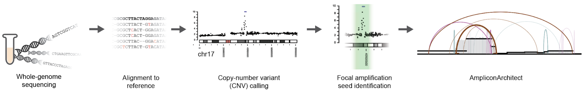

## Primer on running AmpliconArchitect

### Contents
 - [What is AA?](#what-is-aa)
 - [Preparing the inputs](#preparing-the-inputs)
 - [Selecting seed regions](#filtering-and-selecting-seeds-from-cnv-data)
 - [Worked example](#worked-example)
 - [FAQ](#faq)

#

### What is AA?
AmpliconArchitect (AA) is a tool designed to study **focal amplifications** in the cancer genome. AA can help identify common sources of focal amplifications, such as **circular extrachromosomal DNA (ecDNA)**, and **breakage-fusion-bridge cycles (BFBs)**.
 
AA takes as input WGS data and a bed file of regions to examine, and outputs a **breakpoint graph** and a **cycles file**. The **breakpoint graph**
encodes the identity of regions in the genome, their copy numbers (as measured by AA), and the breakpoint junctions between
these elements (as measured by AA). The **cycles file** outputs both non-cyclic paths and cyclic paths which are decompositions
of the breakpoint graph into paths which best explain the CN of the segments.


An open-access publication detailing AA's methodology is available in [Nature Communications](https://www.nature.com/articles/s41467-018-08200-y). Please cite AA if you use it in your work. 
#

### Installing AA
Please refer to the [AA README](https://github.com/virajbdeshpande/AmpliconArchitect#installation) for complete 
installation instructions.

You may also want to install the additonal programs for classifying outputs ([AmpliconClassifier](https://github.com/jluebeck/AmpliconClassifier)) and visualization ([CycleViz](https://github.com/jluebeck/CycleViz)).
#

### Preparing the inputs


AA takes as input a WGS BAM file, and a user-created BED file of seed regions as inputs. Here we will discuss some of 
the best practices for generating these files.

AA uses external CNV calls to determine which regions it should examine - thes are called **CNV seeds**. 
However, AA independently calls copy number inside the seed regions it is tasked with, and thus after selecting the regions, 
**the CN estimates are not propogated into AA's own estimations.**

##### <ins>To help standardize the process of running AA, we have created a wrapper script, called [PrepareAA](https://github.com/jluebeck/PrepareAA) </ins> 

PrepareAA wraps the required steps before running AA. Users will enter the AA workflow from different stages. Some will start with .fastq files, others will have a BAM file only, and others will
already have the BAM file and CNV seed regions they wish to analyze. We have created this wrapper to allow users to enter 
the workflow from any point. PrepareAA wraps BWA MEM for alignment, CNVKit (or Canvas) for CNV seed identification, and will also invoke
the AA `amplified_intervals.py` filtering script to select/filter/merge CNV seeds which are appropriate for AA.

Ultimately, PrepareAA can even invoke AA (if installed beforehand), and thus saves users from the hassle associated with preparing everything to run AA on a sample.

If you decide to "got it alone" and not to use PrepareAA, please carefully read the following points:

#### - Creating the BAM file:
If you are generating your own BAM file, please note that aligners vary in terms of which tags they will add to BAM files. Furthermore,
BAM files hosted on SRA are often stripped of tags needed by AA to correctly identify breakpoints. At this time, we recommend using
**BWA MEM**. However, we have also modified AA so that it will support BAM files created by Illumina's Isaac aligner. Please note that for use with AA, BWA MEM should be run **without** setting the `-m` flag (it's off by default, just don't turn it on).

Please also note that the AA data repo has reference genome fasta files you can align to. We recommend them as they are stripped of alternate contigs, and thus may cause fewer issues with CN estimation in AA.

Don't forget to also create the BAM file index! `samtools index [sample].bam`

#### - Creating the CNV bed file:
In the AA publication, ReadDepth was used as the CNV caller for seeding. However, there are much more modern CNV callers available. **We have found that
AA is fairly robust to the choice of CNV caller for seed identification**. Some other callers we have used successfully include CNVKit, Canvas, Battenberg, and GATK.

If you generate your own file of CNV calls, *please ensure the estimated copy number of these calls is in the last column of the bed file*. 
Secondly, also ensure that the calls you are using are segmented, and not just raw per-bin estimates. This is not a concern for most users,
however **if you notice there are > 50 CNV seeds going into AA, there may be something wrong**.   
#

### Filtering and selecting seeds from CNV data
Focal amplifications are somewhat aribtrarily defined as regions of the genome with a CN > 4 and 10 kbp < size < 10 Mbp.

**Selecting appropriate seed regions from the CNV estimates is critical to properly running AA**.

As default parameters for seed selection, we recommend picking regions which have an estimated CN >= 4.5 and size > 50 kbp. 
However, CNV estimates can be imperfect in low-complexity or repetitive regions. Thus, we have developed a script called `amplified_intervals.py` to address those issues.
It filters and merges CNV estimates provided by the user. `amplified_intervals.py` is wrapped into PrepareAA and will be run by default.

If you are not using PrepareAA though, we **highly recommend you invoke `amplified_intervals.py` on your CNV calls to create a new file of CNV seeds appropriate for AA.**
If low-complexity/repetive seeds are not filtered from AA, it can cause an exremely long runtime and produce results which are not useful. AA has its own filters for these 
regions, but it should still be avoided to give them to AA as input. 

If you have CNV segments which are > 10 Mbp, we suggest you run the `seed_trimmer.py` script in the PrepareAA/scripts directory (and documented in PrepareAA's repo). This will pre-filter some regions of low mappability, conserved CNV gain, etc. 
The output of this script can then be fed to `amplified_intervals.py`. Note that `seed_trimmer.py` is to be run BEFORE `amplified_intervals.py`, if you choose to use it.
#
 
### Running AA
We assume the user now has a coordinate-sorted BAM file, and a CNV seed BED file (i.e., a BED file output by `amplified_intervals.py`).
To check if your BAM file is coordinate-sorted, you can take a peek at the BAM file header by doing 
`samtools view -H your_bamfile.bam | head `. 
Please make sure you know which reference genome it is aligned to so that you can properly specify the `--ref` argument to AA.

For more on running AA, please see the [relevant section of the AA README](https://github.com/virajbdeshpande/AmpliconArchitect#running-ampliconarchitect) or jump down to the [worked example](#worked-example).

Note that PrepareAA can run AA on its own by setting `--run_AA`, and AA will automatically be called at the end of the preparation process without any additional work by the user.
#

### Interpreting the output
"*How do I know if my sample has ecDNA (or BFB, or other)?*"

**We have recently developed classification methods which take AA output and predict the mechanism(s) of a focal amplification's genesis**.
This method is called **[AmpliconClassifier](https://github.com/jluebeck/AmpliconClassifier)**. 
This tool will output a table describing many important details of the focal amplifications AA discovered.

On its own, AA does not automatically produce a prediction of ecDNA or BFB status. It provides the files though that can be used to make that determination.
For more details about deciphering the AA outputs on your own, please see the [relevant section of the AA README](https://github.com/virajbdeshpande/AmpliconArchitect#outputs).
#

### Visualizing the output
AA will generate a visualization of the amplicon with edges/CN on its own. The coloring of the edges represents the [orientation of the read pairs](https://github.com/virajbdeshpande/AmpliconArchitect#4-the-sv-view-out_ampliconidpngpdf).

One common task though is, "*I have identified a likely ecDNA in my sample using AA, and would like to visualize it as a cycle*." 

We have developed a tool called **[CycleViz](https://github.com/jluebeck/CycleViz)**, which can produce a circular or linear 
plot of a path or cycle contained in an a AA cycles file. Please note the instructions for running CycleViz in the README, 
as there is a script to reformat the cycles file from AA prior to running CycleViz.
#

### Worked example
Here are some commands for running AA. We'll assume you're starting with a coordinate-sorted BAM file.

- **Run some "preflight checks"**:

```
echo $AA_DATA_REPO
echo $AA_SRC
echo $MOSEKLM_LICENSE_FILE
```
None of the above should print an empty string.

- **Option 1 - Launch PrepareAA**:

In this specific case, we'll assume you don't have a CNV bed yet, and we'll assume you've installed CNVKit. Please do see the [PrepareAA README](https://github.com/jluebeck/PrepareAA) though to check which flags you need to set in your case.
```
/path/to/PrepareAA/PrepareAA.py -s sample_name  -t number_of_threads --cnvkit_dir /path/to/cnvkit.py --rscript_path /path/to/R_3.5+/Rscript --sorted_bam sample.cs.rmdup.bam [--run_AA]
```

You can still do Option 1 even if you already have CNV calls, or if you only have the fastq files. Just check the README for the commands to use.

 - **Option 2 - Do the steps manually**:
 
 We're going to assume you have your BAM file and a BED file of CNV calls, generated with your favorite CNV caller, where the estimated CN is in the last column of the BED file.
 Let's assume you want to select standard parameters of CN > 4.5 and size > 50 kbp.
 ```
# filter/select the seeds
$AA_SRC/amplified_intervals.py --ref hg19 --bed [your_CNV_calls.bed] --out [sample_name]_AA_CNV_SEEDS --bam [sample_name].bam --gain 4.5 --cnsize_min 50000

# let's take a peek at the seeds. Are they reasonable?
less [sample_name]_AA_CNV_SEEDS.bed

# now run AA
$AA_SRC/AmpliconArchitect.py --ref hg19 --bed [sample_name]_AA_CNV_SEEDS.bed --bam [sample_name].bam --out [sample_name]
```
This will take a while to run. Expect between 30 minutes-6 hours, but sometimes >48 hours if it's a very complex amplicon.

- **Classifying the results**:

Now, we can run a classification of the AA output to determine if ecDNA is present. You will have to install [AmpliconClassifier](https://github.com/jluebeck/AmpliconClassifier) separately. 
```
python amplicon_classifier.py --ref [hg19, GRCh37, or GRCh38] --cycles [/path/to/amplicon_cycles.txt] --graph [/path/to/amplicon_graph.txt] > classifier_stdout.log
``` 
You can also run this on a batch of AA amplicons all at once by following the instructions in the [AmpliconClassifier README](https://github.com/jluebeck/AmpliconClassifier).

- **Creating a circular visualization of the ecDNA**:

Suppose you find that `amplicon1` of your sample `GBM39` represents an ecDNA+ amplicon, and that in the AA cycles file, the most dominant cyclic path is `Cycle1`. Perhaps you would like to visualize this cycle.

1. Install [CycleViz](https://github.com/jluebeck/CycleViz).
2. Convert your AA cycles file into the correct format 
    
    ```$CV_SRC/convert_cycles_file.py -c GBM39_amplicon1_cycles.txt -g GBM39_amplicon1_graph.txt```
3. Run CycleViz (or LinearViz).
```
# note that we use the converted cycles file
$CV_SRC/CycleViz.py --cycles_file GBM39_amplicon1_BPG_converted_cycles.txt --cycle 1 -g GBM39_amplicon1_graph.txt --ref hg19 --label_segs --gene_subset_file Bushman --gene_fontsize 9
```

At the moment, we do not support adding additional tracks of data into the plot (e.g. RNA-seq, ATAC-seq, etc.), but that is coming soon.
#

### FAQ
- **What coverage is needed for AA?**
    - Because the CN of focal amplifications is higher than the background reference, a BAM with 10x coverage will effectively have 100x coverage in a region with CN 10. Thus, even very low coverage BAM files can be used with AA. 
    
- **AA has been running for more than 60 hours. What's wrong?**
    - Please ensure that you selected your CNV seeds appropriately. If you use a CN cutoff any lower than 4, and size < 10 kbp,
     there can be a great many false positive focal amplifications. Secondly, please ensure you used `amplified_intervals.py` to select the CNV seeds appropriately.
     
- **In the amplicon visualizations, what are the different edge colors?**
    - They represent the orientation of the breakpoint. Please see the [relevant section of the AA README](https://github.com/virajbdeshpande/AmpliconArchitect#4-the-sv-view-out_ampliconidpngpdf).
    
- **Is bigger better? Should I use really low CN cutoffs and really small minimum sizes so that I don't miss any ecDNA?**
    - Unfortunately, giving enormous seed regions to AA, (e.g. > 10 Mbp) is not recommended. AA will likely stall. A lower CN threshold is also not better, as in that case it may pick up many more regions which represent non-ecDNA events like segmental tandem duplications.
    
- **How do I tell if an amplification is due to ecDNA or segmental tandem duplication?**
    - For low CN < 4.5, it's not really possible to tell. However, keep the following in mind - when segmental tandem duplications occur, the same breakpoints must be reused every time it is repeated. When a "cyclic" structure accumulates
    in very high CN, this would involve the exact reuse of the same breakpoints many many times in the case of segmental tandem dups. The simpler hypothesis as CN increases, is that it is mediated through an extrachromosomal DNA mechanism. 
    
- **Can AA determine the difference between HSR and ecDNA? Can it find integration points?**
    - From our observations, ecDNA maintains its structure when it integrates into the genome (Turner 2017, *Nature*, Deshpande 2019, *Nat. Comms.*, Luebeck 2020 *Nat. Comms.*). Unfortunately without some sort of imaging data (FISH) or long-range sequencing (Bionano, PacBio, Nanopore), it is not possible to reliably make that determination from AA.

- **There's a region I want AA to examine, but it didn't appear in the CNV seeds, what do I do?**
    - You can force AA to run on a region by creating a BED file with that region specifically included, and then invoking AA directly (do not use PrepareAA or `amplified_intervals.py`). This can also be used to standardize the same AA run on multiple different samples.
 
- **In the cycles file, what do the paths that begin/end with '0+' mean?** 
    - These indicate that the path is non-cylic, and proceeds or is preceeded by the next reference coordinate.  
#
 